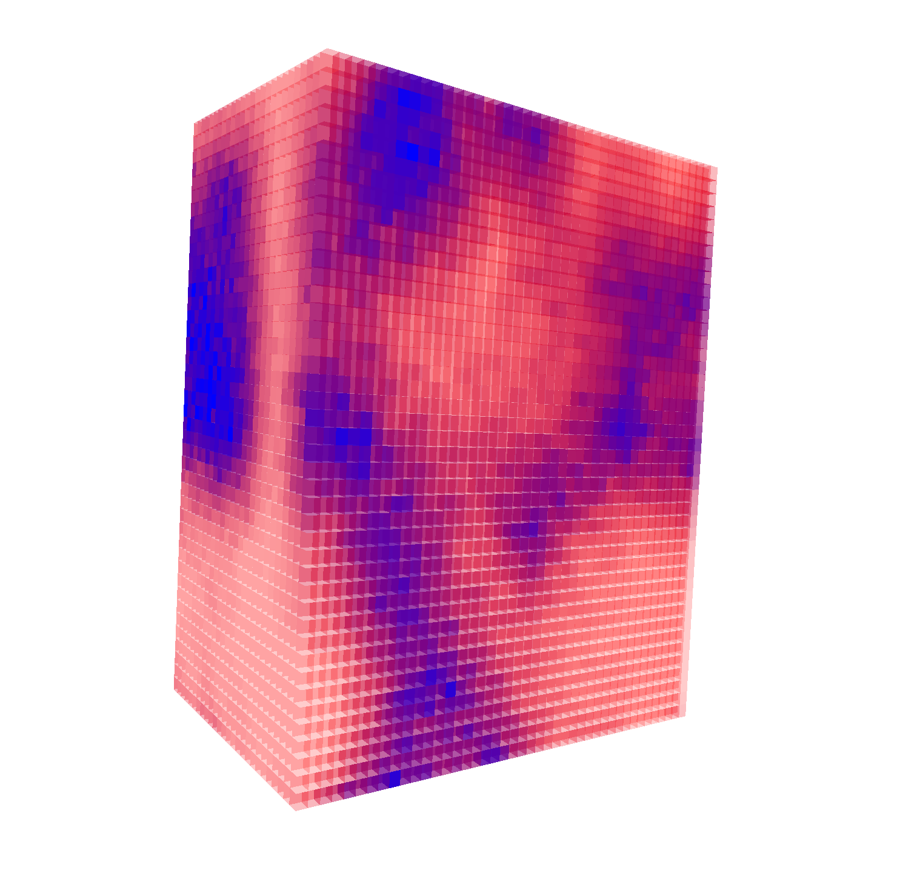

# SimViz
This project is an open source simulation visualization and data analysis tool for atomic simulations.
The project currently supports output files from LAMMPS, Quantum Espresso, VASP, and ASE.
There is other atomic simulation visualiation software available that is freely availble and much more refined.
However, this project was started when other projects failed to meet the needs of our current project, and were not available as source.
The SimViz project provides the foundation to perform volumetric data analysis specific to your project.

Compute local volumetric properties such as mass density or stoichiometry, and then visualize the reslults with an iso-surface or a voxel heat map.
### Iso-surface

    

### Voxel Heat Map

    

### Additional Features
    - Locate crystalline surfaces and find dangling bonds
    - Compute the dipole field of H2O solvated surfaces
    - Find and compute the volume of voids

### Dependencies
    - GLFW > 3.3
    - OpenCL 1.2
    - OpenGL > 3.3

